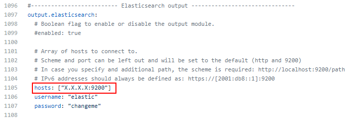
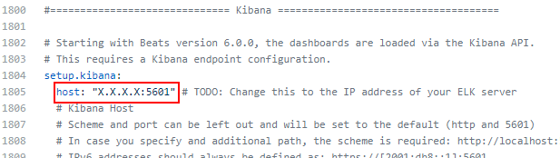

# Automated ELK Stack Deployment

This document contains the following details:
- Description of the Topology
- Access Policies
- ELK Configuration
  - Beats in Use
  - Machines Being Monitored
- How to Use the Ansible Build


These files have been tested and used to generate a live ELK deployment on Azure. They can be used to recreate the entire deployment pictured below. Alternatively, select portions of the playbook file may be used to install only certain pieces of it, such as Filebeat.


### Description of the Topology


The main purpose of this network is to expose a load-balanced and monitored instance of DVWA, the D*mn Vulnerable Web Application.

Load balancing ensures that the application will be highly available, in addition to restricting inbound access to the network. The load balancers processes incoming traffic to be shared acorss the web servers. Access controls that are in place will ensure that only authorized users will be able to connect in the first place through the jump box into the virtual network. 

Integrating an ELK server allows users to easily monitor the vulnerable VMs for changes to the file systems of the VMs on the network and system metrics.

The configuration details of each machine may be found below.

| Name     | Function   | IP Address | Operating System        |
|----------|------------|------------|-------------------------|
| Jump Box | Gateway    | 10.0.0.4   | Ubuntu Server 18.04-LTS |
| Web 1    | Web Server | 10.0.0.5   | Ubuntu Server 18.04-LTS |
| Web 2    | Web Server | 10.0.0.3   | Ubuntu Server 18.04-LTS |
| Web 3    | Web Server | 10.0.0.7   | Ubuntu Server 18.04-LTS |
| ELK      | Monitoring | 10.1.0.4   | Ubuntu Server 18.04-LTS |

### Access Policies

The machines on the internal network are not exposed to the public Internet. 

Only the jumpbox machine can accept connections from the Internet. Access to this machine is only allowed from my public IP address.

Machines within the network can only be accessed by each other.
The Web 1, Web2 and Web 3 VMs send traffic to the ELK server.

A summary of the access policies in place can be found in the table below.

| Name     | Publicly Accessible | Allowed IP Addresses |
|----------|---------------------|----------------------|
| Jump Box | Yes                 | 108.90.5.154         |
| Web 1    | No                  | 10.0.0.1-.254        |
| Web 2    | No                  | 10.0.0.1-.254        |
| Web 3    | No                  | 10.0.0.1-.254        |
| ELK      | No                  | 10.1.0.1-.254        |

### Elk Configuration

Ansible was used to automate configuration of the ELK machine. No configuration was performed manually, which is advantageous because ansible is easy to learn to configure and playbooks are written in YAML to automate all the configuration.

The playbook implements the following tasks:
- Install or update docker to the latest version
- Install PIP that manages required dependancies
- Install python interperter to execute python programs
- Increase memory count to meet [prerequisites for ELK](https://elk-docker.readthedocs.io/#prerequisites)
- Download and launch docker elk container

The following screenshot displays the result of running `docker ps` after successfully configuring the ELK instance.


### Target Machines & Beats
This ELK server is configured to monitor the following machines:
- Web 1 10.0.0.5
- Web 2 10.0.0.3
- Web 3 10.0.0.7

We have installed the following Beats on these machines:
- Filebeat
- Metricbeat

These Beats allow us to collect the following information from each machine:
- **Filebeat**: Monitors log files or locations you specify on remote machines that its installed on. 
- **Metricbeat**: Detects changes in systesm metrics and different types of error events.

### Using the Playbooks

Playbooks are the To-Do list for Ansible that contain the steps to execute on the servers. In this case, our playbooks are going to download, install and configure our ELK and beats deployment. The playbooks need to be copied to the /etc/ansible directory and it's important that the path and file name of the config files match whats in the playbook.

  
In order to use the playbook, you will need to have an Ansible already configured. We are using the jumpbox for this purpose.  

- SSH into the jumpbox `ssh username@jump.box.ip`
- Locate the container name `sudo docker container list -a`
- Start the container `sudo docker container start container_name`
- Connect to the container `sudo docker container attach container_name`

Configuration files needed for Ansible located in /etc/ansible:
  - [Ansible Configuration File](config_files/ansible.cfg) **remote_user will need to be changed to your username**
  ```bash
  #remote_port    = 22
#module_lang    = C
#module_set_locale = False
remote_user = #CHANGE TO YOUR USERNAME
```
  - [Ansible Hosts File](config_files/hosts) **This is where you define the [webservers] and [elkserver] IPs.**
```bash
# List the IP Addresses of your webservers
# You should have at least 2 IP addresses
[webservers]
X.X.X.X ansible_python_interpreter=/usr/bin/python3
X.X.X.X ansible_python_interpreter=/usr/bin/python3


# List the IP address of your ELK server
# There should only be one IP address
[elkservers]
X.X.X.X ansible_python_interpreter=/usr/bin/python3
```
Copy the playbooks to the /etc/ansible folder.
  - [ELK Playbook](config_files/elk-playbook.yml) **remote_user will need to be changed to your username**
  ```bash
  hosts: elkservers
  remote_user: ##CHANGE TO YOUR USERNAME
  become: true
```
  - [Filebeat Playbook](config_files/filebeat-playbook.yml)
- Run the playbook `ansible-playbook elk-playbook.yml`, and navigate to http://[your.VM.IP]:5601/app/kibana to check that the installation worked as expected.

In order to install filebeat, the [Filebeat Configuration](config_files/filebeat-configuration.yml) will need to be copied to the /etc/ansible/files/ directory and the following IPs updated.
- Scroll to line #1105 and replace the IP address with the IP address of your ELK machine.


Scroll to line #1805 and replace the IP address with the IP address of your ELK machine.


After entering your information into the Filebeat configuration file, navigate to the /etc/ansible directory and run: `ansible-playbook filebeat-playbook.yml webservers`

_TODO: Answer the following questions to fill in the blanks:_
- _Which file is the playbook? Where do you copy it?_
- _Which file do you update to make Ansible run the playbook on a specific machine? How do I specify which machine to install the ELK server on versus which to install Filebeat on?_
- _Which URL do you navigate to in order to check that the ELK server is running?

_As a **Bonus**, provide the specific commands the user will need to run to download the playbook, update the files, etc._

## Troubleshooting
